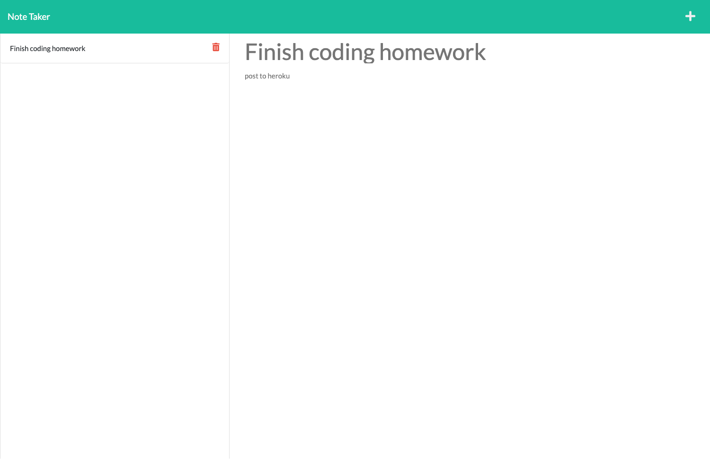

# Note-Taker

## Description

An application called Note Taker that can be used to write, save, and delete notes. This application uses an Express.js back end and will save, retrieve, and delete note data from a JSON file.

## Screenshot

## Link to deployed application

This site was built using [Heroku](https://rmt-note-taker.herokuapp.com)